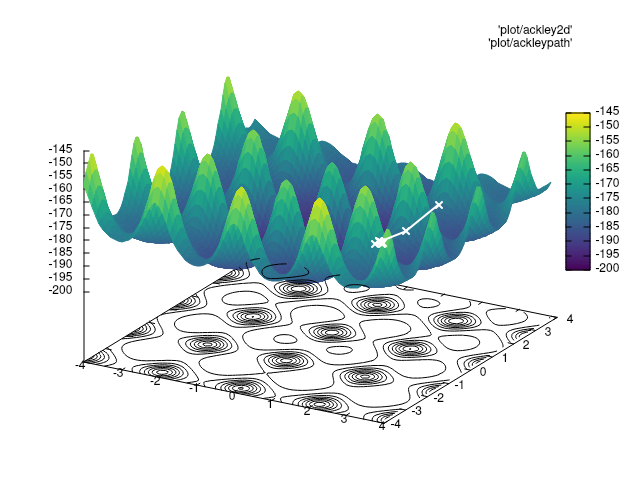

# Broyden-Fletcher-Goldfarb-Shanno

This is an implementation of the BFGS algorithm for a very specific problem, with very specific requirements. You should not expect it to solve a general optimization problem.

## Why ?

In Python, `scipy` has a nice function called [`minimize`](https://docs.scipy.org/doc/scipy/reference/generated/scipy.optimize.minimize.html). It does exactly what I want, but most equivalents in C++ are bloated large-scale solvers such as [Ceres](http://ceres-solver.org/) or [dlib](http://dlib.net/).
Furthermore, `minimize` uses a Fortran subroutine to perform line search.
The goal of this solver is to reproduce the behaviour of `minimize` with [Eigen](http://eigen.tuxfamily.org/index.php) as the only dependency, and maybe no dependency if I manage to make it faster for my use-case.

## Testing

Ideally aiming for very fast results on low dimensional, non-convex, differentiable functions. Dimension of input vector should very rarely exceed ~15. Using test functions from [BenchmarkFcns](http://benchmarkfcns.xyz/fcns).

## Sanity checks

To check function and solver appearance, `make plot fun=FUNCTION_FILE path=PATH_FILE`

## Acknowledgements

- [fable](http://cci.lbl.gov/fable/) for converting Fortran subroutines to C++ code
- [scipy](https://www.scipy.org/) for their BFGS implementation
