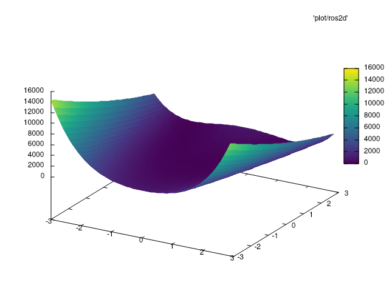

# Broyden–Fletcher–Goldfarb–Shanno

This is an implementation of the BFGS algorithm for a very specific problem, with strange requirements.

## Sanity checks

To check function appearance, `plot()` to file, and `gnuplot -e "splot FILE with pm3d; pause -1"`
